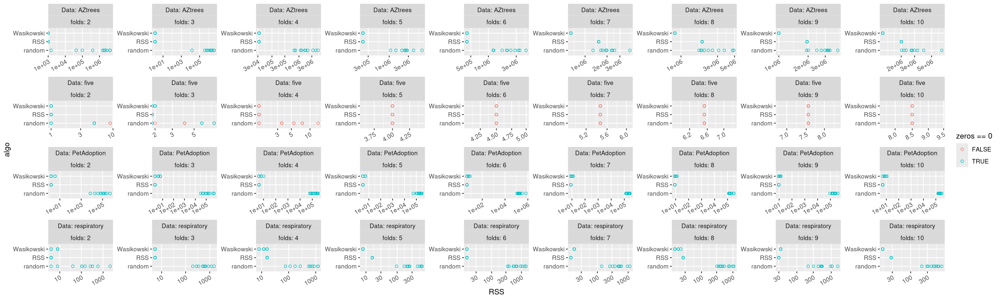
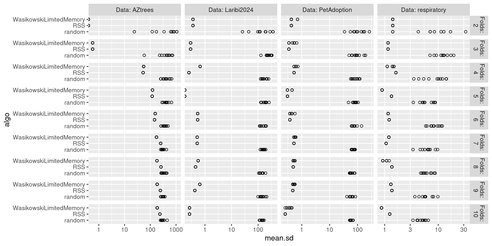
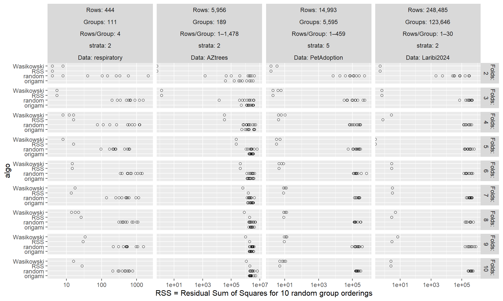
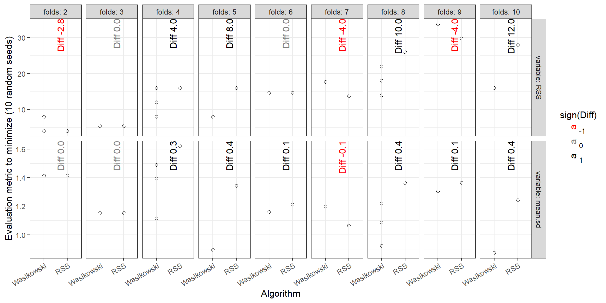
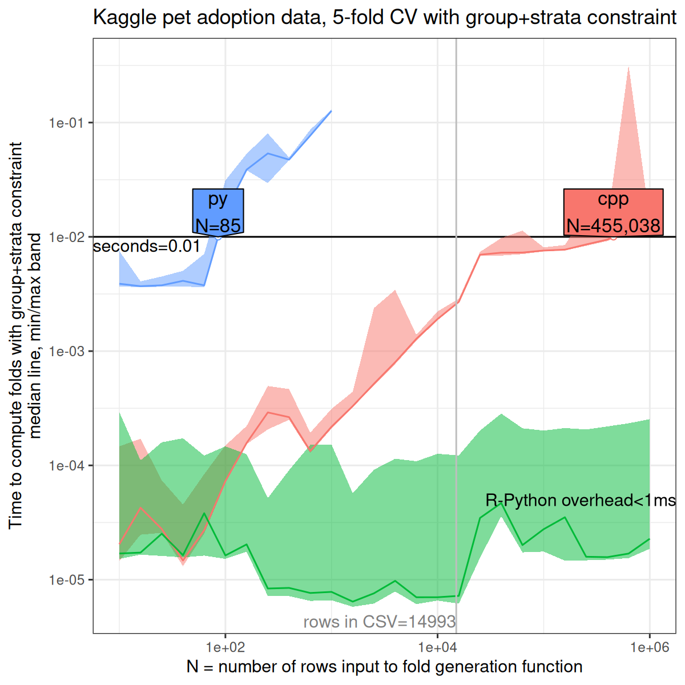
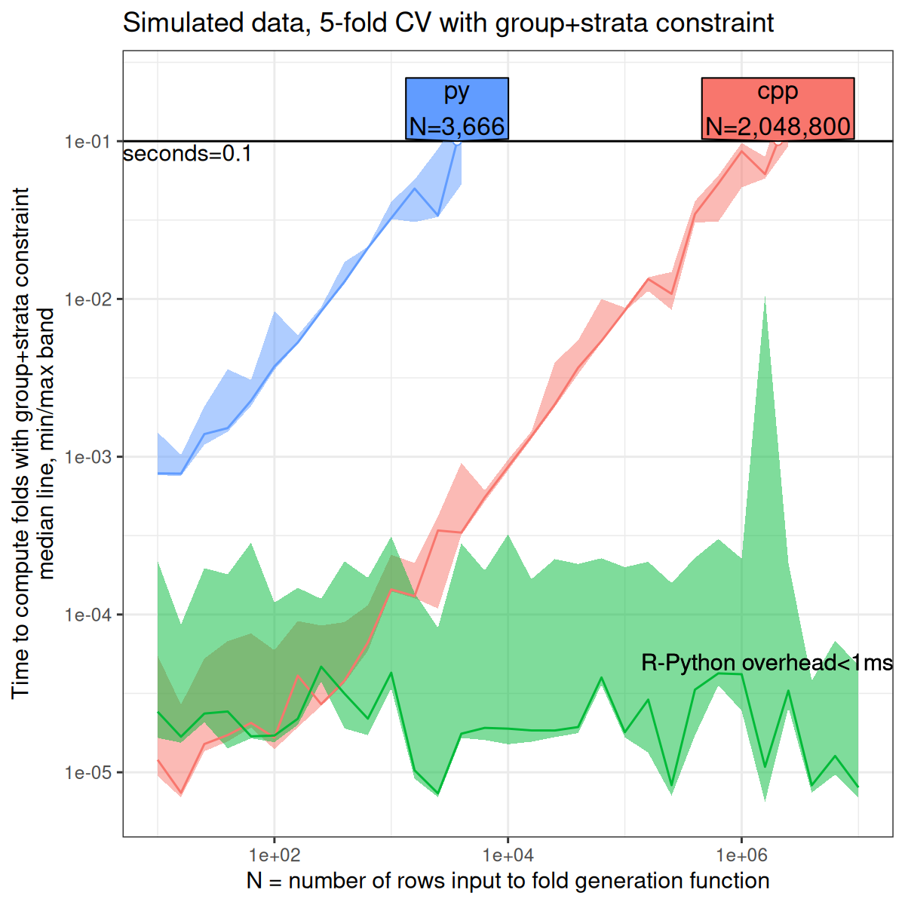

** 3 June 2026

Added code in [[file:data.R]]  to download [[file:Laribi2024full.csv]] from https://zenodo.org/records/12954673

New [[file:Laribi2024-figure-data.R]] runs timings, saving [[file:Laribi2024-figure-data.rds]].
[[file:Laribi2024-figure.R]] reads that and makes

[[file:Laribi2024-figure-rows.pdf]]

[[file:Laribi2024-figure-refs.pdf]]

** 11 May 2026

[[file:data.R]] creates standard data set CSV files under data/.

[[file:data_meta.R]] creates [[file:data_meta.csv]]

[[file:several_Tasks_data.R]] reads data set CSV files and writes [[file:several_Tasks_data.csv]]

[[file:several_Tasks.R]] reads that and makes figures:

We see that neither Wasikowski nor RSS is always the best, but both are generally much better than random.
Interestingly

- in AZtrees there are a few very large groups, so best RSS is very large for more than 3 folds.
- generally the evaluation metrics are consistent but in respiratory, that is not always the case:
  - for 7 folds, RSS is slightly better in both evaluation metrics. (consistent)
  - for 8 folds, Wasikowski is slightly better in both evaluation metrics. (consistent)
  - for 9 folds, Wasikowski has better mean.sd but RSS has better RSS. (inconsistent)
  - for 2 and 6 folds, one evaluation metric says algos are same, other says one is better. (inconsistent)

** previous

[[file:opt.R]] is a proof-of-concept for RSS minimization.

[[file:stratified_atime_data.R]] makes [[file:stratified_atime.RData]]

[[file:stratified_atime.R]] makes

- [[https://github.com/tdhock/mlr3resampling/issues/86#issuecomment-4296787363][comment]]: data respiratory, R code.
- [[https://github.com/scikit-learn/scikit-learn/blob/fe2edb3cd/sklearn/model_selection/_split.py#L893][sklearn code]]
- [[https://www.kaggle.com/code/jakubwasikowski/stratified-group-k-fold-cross-validation/notebook][kaggle]]: [[file:stratified-group-k-fold-cross-validation.ipynb][notebook]], [[file:train.csv.zip][zip]], [[file:train.csv][csv]], [[file:stratified-group-k-fold-cross-validation.py][python script]].
